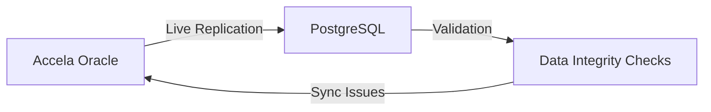

# Database Technology Decision: PostgreSQL

## Current Choice: PostgreSQL

We've chosen PostgreSQL as our primary database. Here's the analysis:

## PostgreSQL vs Alternatives

### PostgreSQL (Our Choice) ✅
**Pros:**
- **JSONB Support**: Perfect for dynamic fields requirement
- **Open Source**: No licensing costs (huge for government)
- **FedRAMP Compatible**: Many FedRAMP-approved PostgreSQL providers
- **Proven Scale**: Discord, Instagram, etc. use it at massive scale
- **Full ACID Compliance**: Critical for permit integrity
- **Rich Extensions**: PostGIS for mapping, pg_vector for AI embeddings
- **Active Development**: Regular updates and security patches

**Cons:**
- Not as common in government as Oracle/SQL Server
- Some DBAs may need training
- Less built-in enterprise tools than Oracle

### Oracle (What Accela Uses) ❌
**Pros:**
- Government standard (many cities already have licenses)
- Excellent enterprise tools
- Strong support and consulting ecosystem
- Battle-tested at scale

**Cons:**
- **Expensive**: $47,500 per processor core + support
- **Vendor Lock-in**: Hard to migrate away
- **Complex Licensing**: Easy to accidentally violate
- **Overkill**: Most features unused for permits

### SQL Server ❌
**Pros:**
- Common in government
- Good Microsoft ecosystem integration
- Strong tooling

**Cons:**
- **Windows-centric**: Limits deployment options
- **Expensive**: $3,717 per core for Standard
- **Limited JSONB**: Not as flexible as PostgreSQL
- **Azure Lock-in**: Best features require Azure

### MongoDB ❌
**Pros:**
- Ultimate flexibility for dynamic fields
- Good for document storage
- Horizontal scaling

**Cons:**
- **Not ACID by default**: Deal-breaker for permits
- **Less government adoption**: Compliance concerns
- **Eventual consistency**: Problem for financial data
- **Less mature**: For complex relational data

## Why PostgreSQL is Best for PermitAI

### 1. **Dynamic Fields Requirement**
```sql
-- PostgreSQL JSONB is perfect for council-demanded fields
ALTER TABLE permits 
ADD COLUMN custom_fields JSONB DEFAULT '{}';

-- Query dynamic fields efficiently
SELECT * FROM permits 
WHERE custom_fields->>'special_requirement' = 'historic_district';
```

### 2. **Cost Advantage**
- PostgreSQL: $0 (open source)
- Oracle: ~$500K+ for medium city
- SQL Server: ~$50K+ for medium deployment
- **Savings can fund 5-10 developer years**

### 3. **Migration from Accela**
```sql
-- PostgreSQL can easily import from Oracle
-- Built-in Foreign Data Wrappers for live migration
CREATE EXTENSION oracle_fdw;
CREATE SERVER accela_oracle FOREIGN DATA WRAPPER oracle_fdw
  OPTIONS (dbserver '//accela-db:1521/PERMITS');
```

### 4. **Government Compliance**
- AWS GovCloud RDS PostgreSQL is FedRAMP High
- Azure Government Database for PostgreSQL available
- Encryption at rest/transit built-in
- Audit logging native support

### 5. **AI/ML Integration**
```sql
-- pgvector for AI embeddings
CREATE EXTENSION vector;
ALTER TABLE permits ADD COLUMN embedding vector(1536);

-- Semantic search for similar permits
SELECT * FROM permits
ORDER BY embedding <-> '[0.1, 0.2, ...]'::vector
LIMIT 10;
```

### 6. **Scale Considerations**
- **Vertical**: Can handle 10TB+ databases
- **Horizontal**: Read replicas for reporting
- **Partitioning**: By date/jurisdiction for performance
- **Connection Pooling**: PgBouncer for high concurrency

## Migration Strategy from Accela/Oracle

### Phase 1: Parallel Run


### Phase 2: Gradual Cutover
- Read from PostgreSQL, write to both
- Validate data consistency
- Move write traffic to PostgreSQL
- Keep Oracle as backup

### Phase 3: Full Migration
- PostgreSQL as primary
- Oracle in read-only mode
- After 90 days, decommission Oracle

## Specific Government Benefits

1. **Procurement**: "No vendor lock-in" is huge selling point
2. **Budget**: Save $500K+/year on database licenses
3. **Security**: Open source = auditable code
4. **Flexibility**: Can run on-premise or any cloud
5. **Future-proof**: Not dependent on vendor roadmap

## Risk Mitigation

1. **DBA Training**: Include PostgreSQL training in implementation
2. **Support**: Offer enterprise support through EnterpriseDB/Crunchy Data
3. **Tools**: Provide familiar tools (pgAdmin, DBeaver)
4. **Documentation**: Create Oracle->PostgreSQL translation guide

## Recommendation

**Stay with PostgreSQL**. The combination of:
- Zero licensing cost
- Superior dynamic field support (JSONB)
- FedRAMP compliance options
- Modern development experience
- Easy Accela migration path

Makes it the clear winner for PermitAI's government-focused platform.

## Next Steps

1. Create PostgreSQL best practices guide for government
2. Build Oracle->PostgreSQL migration tools
3. Partner with Crunchy Data for enterprise support option
4. Develop "PostgreSQL for Oracle DBAs" training